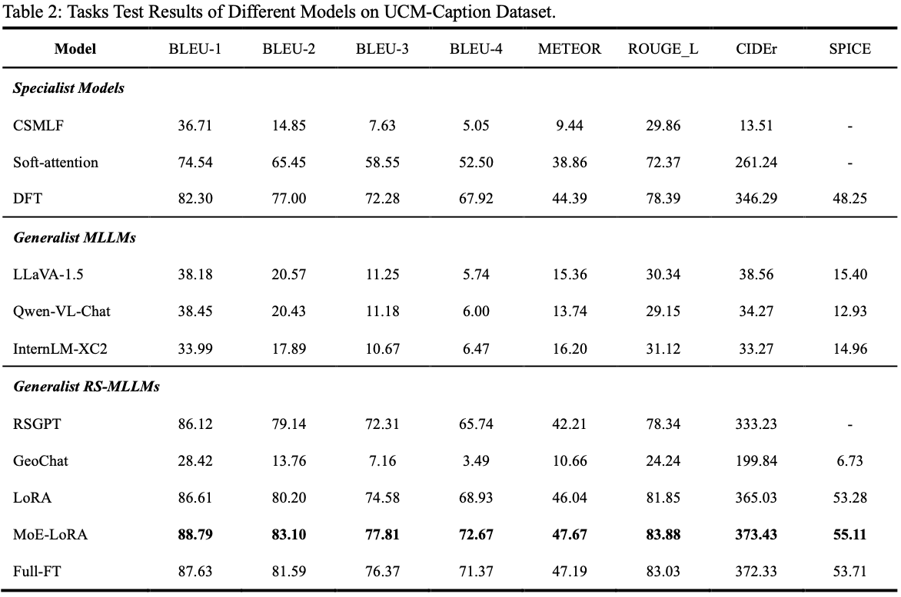
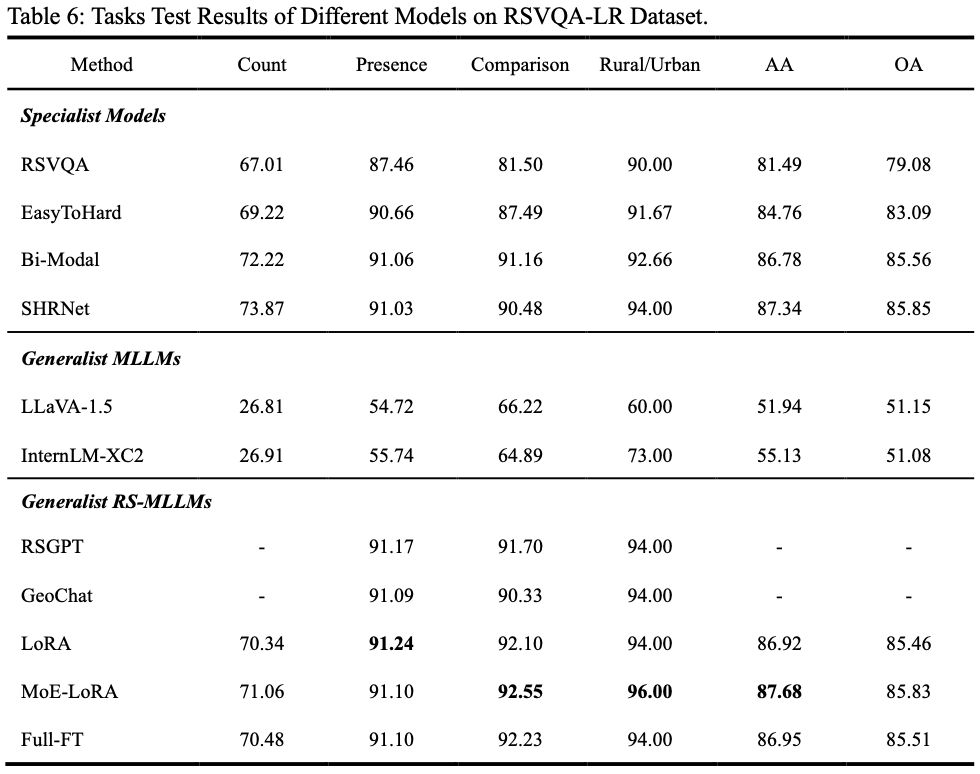
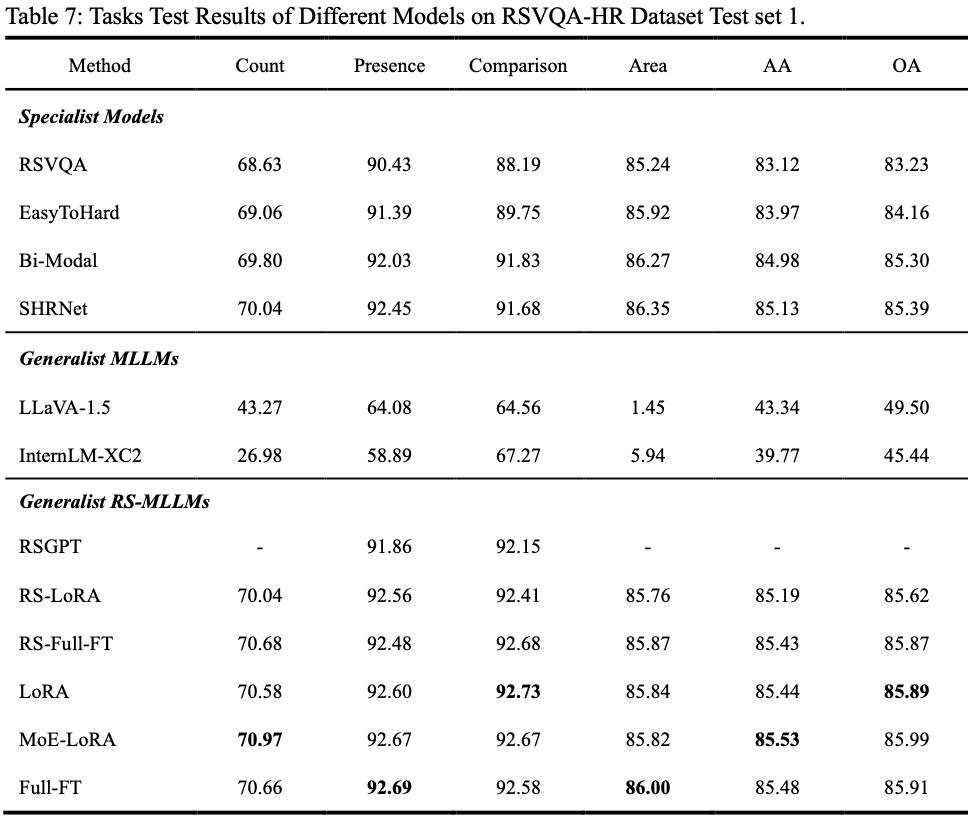
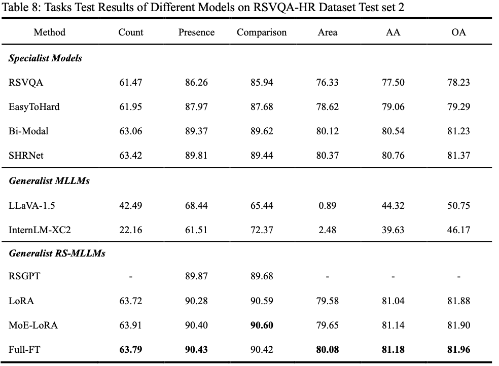
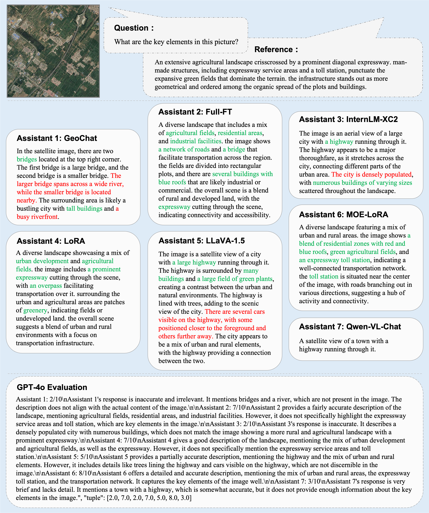

# 1. Comprehensive Comparison of Datasets

# 2. Image Captioning Task

# 3. Visual Question Answering Task

# 4. Visual Grounding Task

Compares the accuracy (Pr@0.5) of various models on the DIOR-RSVG dataset, using the DIOR dataset split for training and testing.

# 5. RS-GPT4V-Instruct

# 6. Free-form Visual Chat

**Figure 1**: GPT-4o scores seven MLLM models for complex reasoning

**Figure 2**: GPT-4o scores seven MLLM models for detailed description

# 7. Statistics of RS-GPT4V-Instruct Dataset

**Figure 3:** Instruction: RS-GPT4V-Instruct Test

**Figure 4:** Response: RS-GPT4V-Instruct Test

**Figure 5:** Instruction: RS-GPT4V-Instruct Train

**Figure 6:** Response: RS-GPT4V-Instruct Train

