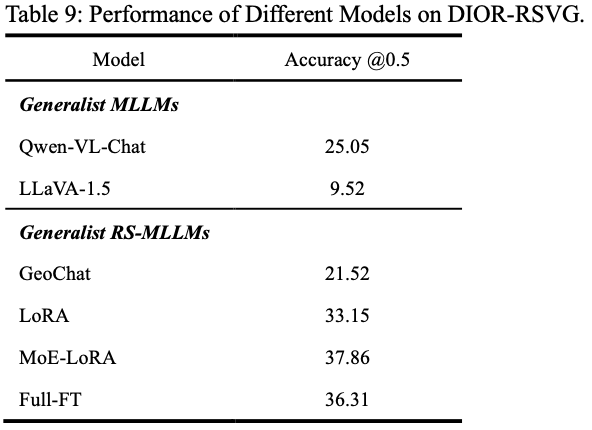

# 1. Comprehensive Comparison of Datasets

# 2. Image Captioning Task

# 3. Visual Question Answering Task

# 4. Visual Grounding Task

Compares the accuracy (Pr@0.5) of various models on the DIOR-RSVG dataset, using the DIOR dataset split for training and testing.
